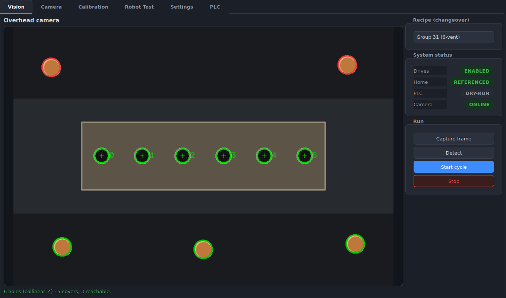
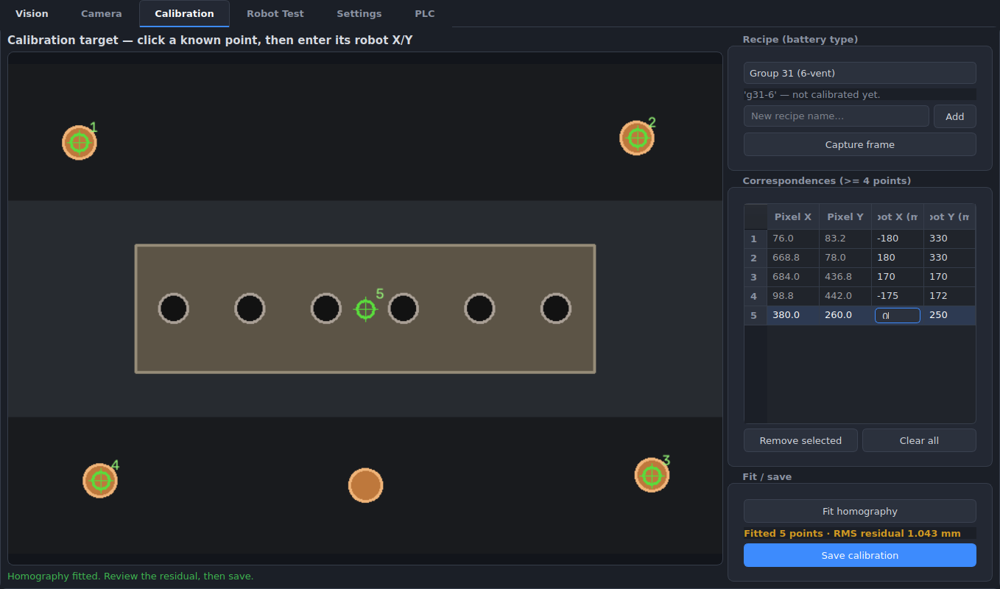
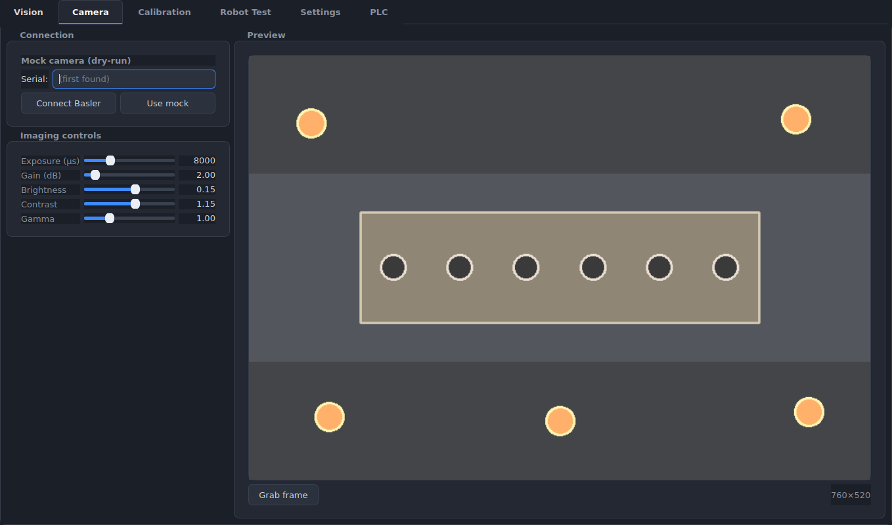
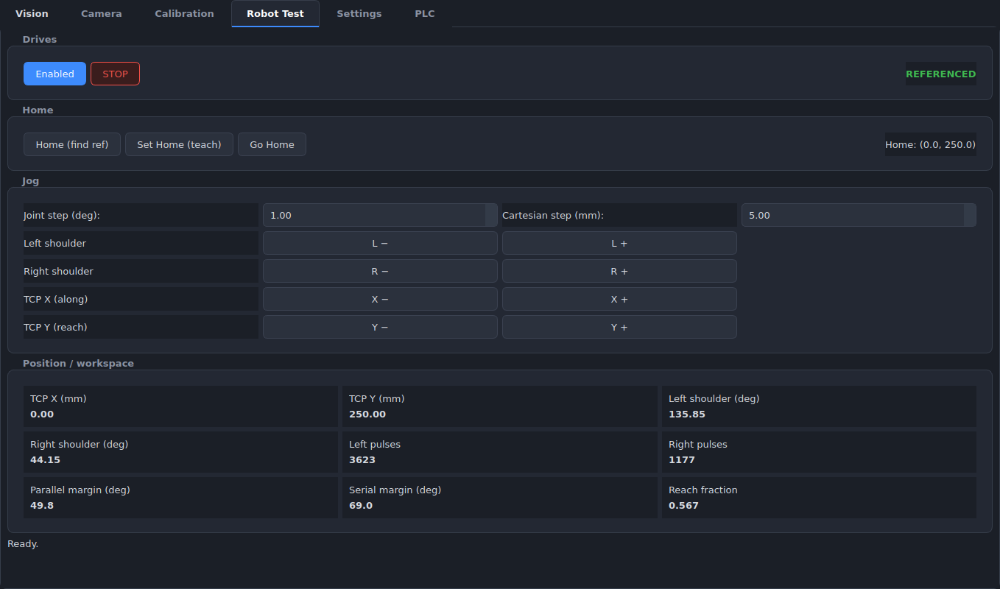
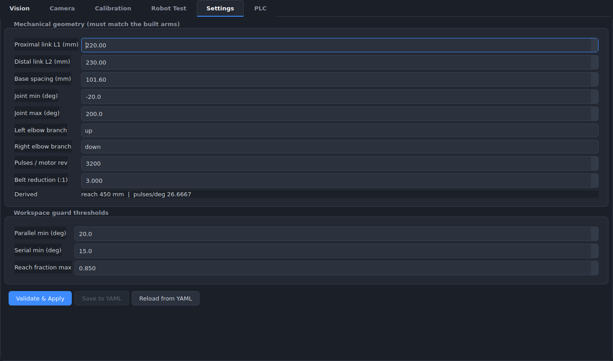
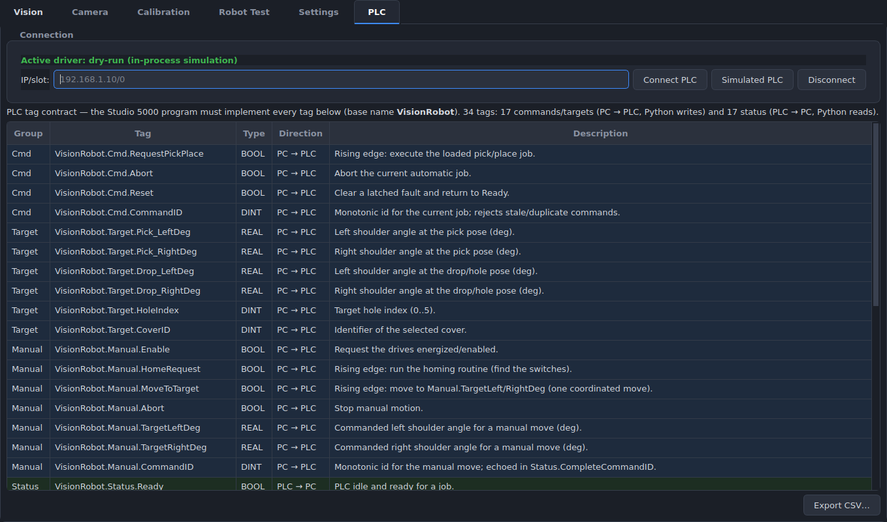

# Vision-Guided 5-Bar Bung-Cover Robot

Python + OpenCV control for a vision-guided **5-bar parallel-SCARA** pick-and-place
robot that installs plastic battery bung covers into the vent holes of a Group 31
battery on an indexing conveyor. An overhead camera detects holes and loose covers;
Python solves the 5-bar inverse kinematics, validates the target against the
workspace/singularity guard, and hands one pick/place job to a CompactLogix PLC.

See [`Claude.md`](Claude.md) for the full design, the verified geometry, and the
hardware/software responsibility split.

## Screenshots

A PySide6 dark-theme HMI. The **Vision** tab is the main run screen — detected
vent holes (numbered) and loose covers (green = reachable and correctly sized,
red = outside the clean work zone), with live drive / home / PLC / camera status
and the automatic pick-place cycle behind **Start**.



|  |  |
|---|---|
| **Calibration** — click known points, fit a per-recipe pixel→robot homography (RMS residual reported) | **Camera** — Basler imaging controls with a live preview |
|  |  |
| **Robot Test** — reference, teach home, and jog (every move workspace-validated) | **Settings** — geometry + workspace-guard thresholds, re-validated on apply |
|  |  |
| **PLC** — connect a driver at runtime + the full tag contract the Studio 5000 program must implement |  |
|  |  |

## Status

The full pipeline is implemented and tested end-to-end (141 tests) — it runs in
dry-run, against a simulated PLC, or on real hardware:

> **capture → detect (holes + covers) → per-recipe calibration (pixel→robot) →
> workspace/singularity validation → plan pick & drop → PLC pick/place handshake
> → re-image → next hole.**

| Area | Status |
|---|---|
| Kinematics + workspace/singularity guard (`robot/{fivebar_kinematics,workspace}.py`) | done, tested |
| Camera — Basler (pypylon) + mock (`vision/camera.py`) | done, tested |
| Detection — holes (collinear) + covers (quality / size / reachability) (`vision/detect_*.py`) | done, tested |
| Per-recipe calibration + changeover (`vision/calibration.py`, `app/recipes.py`) | done, tested |
| Motion drivers — dry-run + PLC over EtherNet/IP + simulator (`robot/driver.py`, `plc/*`) | done, tested |
| Planner + pick/place handshake (`robot/planner.py`, `plc/handshake.py`) | done, tested |
| Automatic cycle, off the UI thread (`app/cycle_manager.py`, `gui/cycle_worker.py`) | done, tested |
| PySide6 HMI — Vision · Camera · Calibration · Robot Test · Settings · PLC | done, tested |
| CLI entry (`main.py`, `app/launch.py`) | done, tested |
| `app/diagnostics.py` (save annotated fail frames) | deferred |

## Setup

```bash
python -m venv .venv
source .venv/bin/activate          # Windows: .venv\Scripts\activate
pip install -e .[dev]              # installs the package + pytest
```

## Test

```bash
pytest -q
```

The tests encode the design verification from `Claude.md` §3: the whole work zone
(six holes + cap pick point + ±2 in cross-conveyor tolerance) clears every
singularity and reach check.

## Quick use

```python
from bung_cover_robot.robot import FiveBarKinematics, WorkspaceValidator

kin = FiveBarKinematics()             # verified default geometry
validator = WorkspaceValidator(kin)

x, y = 0.0, 250.0                     # robot-frame TCP target (mm)
result = validator.validate(x, y)     # ALWAYS gate on this before the PLC
if result.ok:
    target = kin.inverse(x, y)
    print(target.left_deg, target.right_deg)
else:
    print("rejected:", result.reason)
```

**Rule:** never send a target to the PLC without `WorkspaceValidator.validate()`
returning `ok` (Claude.md §9, §15).

## Camera (Basler)

Native Basler controls are reached through Basler's `pypylon` SDK; frames come
back as OpenCV-native BGR `numpy` arrays. A `MockCamera` provides synthetic
frames so the pipeline runs with no hardware (`--dry-run`).

```python
from bung_cover_robot.vision import (
    open_camera, CameraConfig, CameraControls,
)

config = CameraConfig.from_yaml("config/camera_config.yaml")
controls = CameraControls.from_yaml("config/camera_config.yaml")

# mock=True for dry-run; drop it (or pass mock=False) for a real Basler.
with open_camera(config, controls, mock=True) as cam:
    frame = cam.grab()                       # OpenCV BGR ndarray

    # Exposed controls — by logical name, resolved to the right GenICam node:
    cam.set_control("exposure_time_us", 6000.0)
    cam.set_control("brightness", 0.2)
    cam.set_control("contrast", 1.1)
    cam.set_control("gain", 3.0)
    print(cam.get_control("exposure_time_us"))
```

Logical control names (`brightness`, `contrast`, `exposure_time_us`, `gain`,
`gamma`, `black_level`, `saturation`, `sharpness`, ROI, orientation, …) are
mapped to per-model GenICam nodes in `CONTROL_REGISTRY`; you can also pass a raw
GenICam node name or extra nodes via `CameraControls(extra={...})`. On a real
camera, `BaslerCamera.list_devices()` enumerates connected cameras and
`control_range(name)` returns a control's `(min, max)` for building sliders.

## GUI (robot HMI)

A PySide6 tabbed HMI (see [Screenshots](#screenshots)). Every commanded move is
gated by `WorkspaceValidator` before it reaches the driver.

```bash
pip install -e .[gui]
bung-cover-robot                         # dry-run: in-process sim driver + demo scene
bung-cover-robot --sim-ec                # EtherCAT driver vs a simulated A6 network
bung-cover-robot --ethercat              # real A6 servo drives (IgH EtherCAT master)
bung-cover-robot --camera basler         # real Basler (else the mock demo scene)
bung-cover-robot --config /path/to/config  # config dir (robot/camera/recipes yaml)
```

`--dry-run` / `--sim-ec` / `--ethercat` select the motion backend and `--camera
{auto,mock,basler}` the camera, independently. Also runs as `python -m
bung_cover_robot`.

**Deploying to a real control PC** (IgH EtherCAT master + servos): run
`scripts/install.sh` and follow **[`docs/deploy.md`](docs/deploy.md)** — venv +
app install, rebuilding the RT daemon on the target, passwordless-sudo for the
daemon, and migrating your `config/` (calibration, home, recipes).

**Vision tab** (main screen) — capture, **Detect** (holes + covers with live
reachability), and **Start / Stop** the automatic pick-place cycle. Each pick
re-images (loose covers shift), and the cycle runs on a worker thread so a
multi-second PLC handshake never freezes the HMI. A **Recipe (changeover)**
selector loads the active battery type's calibration + vent-hole count.

**Camera tab** — connect a Basler (or the mock), with exposure / gain /
brightness / contrast / gamma controls written through to the camera and a live
preview.

**Calibration tab** — build a real pixel→robot calibration per recipe: pick the
recipe (or add one), click known points on a captured frame, type their
robot-frame XY, **fit** the homography (≥4 non-collinear points; reports the RMS
residual in mm), and **save**. A saved calibration is adopted by the Vision tab
live when it's the active recipe.

**Robot Test tab:**
- **Drives** — Enable / STOP. Motion is refused while disabled.
- **Home** — *Home (find ref)* runs the hardware homing routine (find the home
  switches) and adopts the reference pose; *Set Home (teach)* captures the
  current pose as the software home; *Go Home* drives back to it. Jogging
  requires the robot to be **referenced** first.
- **Jog** — per-shoulder joint jog (L±, R±) and Cartesian TCP jog (X±, Y± in the
  robot frame), with independent joint-step (deg) and Cartesian-step (mm) sizes.
  *Absolute-incremental*: each press computes a new absolute target, validates
  it, and commands one coordinated move.
- **Position / workspace** — live TCP, shoulder angles, drive pulses, and the
  parallel/serial singularity margins + reach fraction. A jog that would leave
  the clean workspace is rejected with the reason; the robot doesn't move.

**Settings tab** — view/edit mechanical geometry (L1, L2, spacing, joint limits,
branch, drivetrain) and the workspace guard thresholds. *Validate & Apply*
re-runs the full work-zone validation and **refuses** geometry that can't clear
every singularity/reach check (Claude.md §3); *Save to YAML* persists only
validated geometry to `config/robot_config.yaml`.

**PLC tab** — connect/disconnect the motion driver at runtime (dry-run,
simulated PLC, or a real CompactLogix by IP/slot) and a read-only table of the
full tag contract the PLC must implement. To build the Studio 5000 side, start
with **[`docs/plc_setup.md`](docs/plc_setup.md)** — step-by-step bring-up
(network the Teknic ClearLink, import Teknic's CompactLogix example `.L5K`,
create the tags, commission). Reference material: [`docs/plc_program.md`](docs/plc_program.md)
(architecture, UDT, tag contract), [`docs/plc_ladder.md`](docs/plc_ladder.md) and
[`docs/plc_homing.md`](docs/plc_homing.md) (ladder + Structured Text matched to
Teknic's examples), and [`docs/homing.md`](docs/homing.md) (switch placement).

The GUI is a thin view over the headless `RobotTestController`, which drives a
swappable `RobotDriver`:
- `DryRunRobotDriver` — in-process simulation.
- `PlcRobotDriver` — manual jog/home over EtherNet/IP (pycomm3), using the
  `VisionRobot.Manual.*` tag surface (`plc/tags.py`). A `SimulatedPlcClient`
  emulates the ladder so `--sim-plc` runs the real handshake with no hardware.
  To drive a real robot, the Studio 5000 program must implement those tags +
  the homing routine (see the PLC contract note below).
