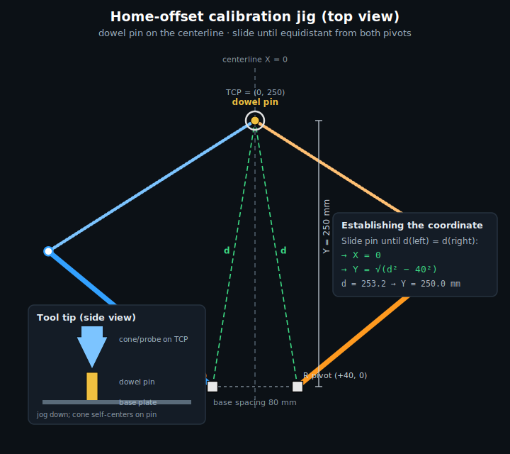

# Home-offset calibration (`HOME_OFFSET_L` / `HOME_OFFSET_R`)

How to measure and set the two home-offset constants so the PLC reports the
**true** shoulder angles after homing. Do this once per machine at
commissioning (and again only if you move a home switch or change the homing
approach). The app does the math — you build a simple jig, seat the tool on it,
and click **Compute**. Backed up/restored with the **PLC tab → Commissioning
constants** panel (see `plc_setup.md`).

---

## 1. What the offset is, and why it exists

The ClearLink zeroes each motor's position **at the home-switch (prox) trip
point**, not at a meaningful shoulder angle. Right after homing,
`Motor0/1_CommandedPosn = 0` even though the arm sits at some real angle. The
PLC converts commanded steps to a published angle with:

```
ActualLeftDeg  = (Motor0_CommandedPosn + HOME_OFFSET_L) / STEPS_PER_DEG
ActualRightDeg = (Motor1_CommandedPosn + HOME_OFFSET_R) / STEPS_PER_DEG
```

* **Motor0 = left** shoulder, **Motor1 = right** shoulder.
* `STEPS_PER_DEG = 26.66667` (3200 pulses/rev × 3:1 / 360).

`HOME_OFFSET` is therefore **the true shoulder angle at the trip point, in
steps**. If the switch tripped exactly at the design home pose
(L 140.5406° / R 39.4594°) the offsets would be the shipped nominals
**3748 / 1052**. In practice the switch is a few tenths off, so you measure the
real value.

> **You don't measure the home angle directly — you derive it.** Homing tells
> you nothing about the absolute angle, and you never find out. What the
> ClearLink *does* give you after homing is a **running count of steps commanded
> away from the trip point** (`CommandedPosn`, zeroed at home). So: jog to a
> point whose true angle you know from its coordinate; the count is how far the
> arm moved to get there. A known endpoint minus the counted move gives the
> start:
>
> ```
> angle_at_home = θ_jig − CommandedPosn / STEPS_PER_DEG
> HOME_OFFSET   = angle_at_home × STEPS_PER_DEG
>               = θ_jig × STEPS_PER_DEG − CommandedPosn
> ```
>
> Like pacing off the distance from a labeled mark: you don't need to know where
> you started, only the known endpoint and the steps you counted getting there.
> The jig supplies that one absolute reference — without it you'd have only
> relative motion and no way to anchor it.

> **Open-loop steppers — no encoder.** The EM806 drives are open-loop; the
> ClearLink's `CommandedPosn` is the **commanded step count** from the home
> datum, not an encoder reading. That's exactly what we want here: right after
> homing there are no lost steps, so the commanded count *is* the arm's position
> relative to the trip point. Jog gently to the jig (don't stall) so no steps
> are dropped between home and the measurement.

> **Why not a digital level?** This is a horizontal-plane SCARA — the arms sweep
> in a plane parallel to the floor. A gravity inclinometer reads 0° everywhere
> in that plane, so it can't measure the in-plane shoulder angle. The offset is
> calibrated from a **known TCP position** instead.

---

## 2. Before you start

Calibrate the offset **last**, after these are done — an offset measured on a
drifting or mis-scaled axis is worthless:

1. **Homing is repeatable.** `HOME_VEL_0/1` sign drives *toward* the prox, the
   back-off/re-approach is tuned, and re-homing several times lands the same
   trip point (watch `M0/M1 CommandedPosn` return to 0 consistently).
2. **`STEPS_PER_DEG` is verified.** Command a 90° shoulder jog and measure the
   real sweep; fix step wiring / microstepping until it matches 26.66667.

---

## 3. Build the jig (establish one known point)

You need **one point whose robot-frame (X, Y) you know**. The robot frame origin
is the **midpoint between the two shoulder pivots**; +X runs along the line
joining them (toward the right pivot), +Y is perpendicular, into the work area.
The two pivots sit at **(−40, 0)** and **(+40, 0)** mm (80 mm base spacing).



The easy, accurate point is **on the centerline (X = 0)** — the locus
equidistant from both pivots. Build it like this:

1. **Mark the two shoulder-pivot centers** (the motor output-shaft axes). These
   define the frame; measure them carefully.
2. **Mount a vertical dowel pin** on the base plate, out in the work zone
   (~250 mm from the pivot line is ideal — that's in the stiff part of the
   envelope).
3. **Slide/adjust the pin until it is equidistant from both pivots.** Measure
   pin-center → left-pivot and pin-center → right-pivot with a caliper or tape;
   make them equal. Call that equal distance **d**. The pin is now at **X = 0**,
   and:

   ```
   Y = sqrt(d² − 40²)          # 40 mm = half the 80 mm base spacing
   ```

   (e.g. d = 253.2 mm → Y = √(253.2² − 40²) = 250.0 mm.) No perpendicular
   measurement needed — one equal-distance reading gives you the coordinate.
4. **Fit a self-centering tool tip.** Swap the vacuum cup for a pointed probe or
   a bushing that mates the dowel (cone-into-hole or pin-into-bushing). It
   removes the guesswork of "is it seated" and repeats to a few thousandths.

> **Cross-check (recommended):** add a second pin at a different Y on the same
> centerline. Calibrating from each should give offsets that agree within a step
> or two. A big disagreement means the trip point isn't repeatable (§2.1) or
> `STEPS_PER_DEG` is off (§2.2).

---

## 4. Run the calibration (in the app)

No calculator, no command line — the program reads the counts and solves it.

1. **Home** the robot (Robot Test → Home). Confirm `Has Homed`; both
   `CommandedPosn` read ~0.
2. **Seat the tool** on the jig pin (jog there gently in small steps).
3. Open **PLC tab → Commissioning constants → "Calibrate HOME_OFFSET from a
   known point."**
4. Enter the jig's **X** and **Y** (e.g. `0` and your computed `Y`).
5. Click **Compute from PLC.** The app reads both `Motor*_CommandedPosn`, solves
   `HOME_OFFSET = round(θ·STEPS_PER_DEG − CommandedPosn)` per axis, and shows the
   angles, the counts, and the resulting offsets.
6. Click **Apply to table** to drop the two values into the `HOME_OFFSET_L/R`
   rows, then **Push to PLC…** to write them live.

---

## 5. Verify

Re-home, jog the tool back onto the jig, and confirm the Diagnostics tab now
reads `ActualLeftDeg ≈ θL`, `ActualRightDeg ≈ θR` for that point. If you built a
second pin, check it tracks there too.

---

## 6. Back it up (disaster recovery)

Once verified, click **Read from PLC (snapshot)** in the same panel. It saves
the whole set-by-hand set — including your calibrated offsets — to
`config/plc_constants.yaml`. If the controller is ever reloaded or cleared,
**Push to PLC** restores it in one shot. (Studio 5000 does not restore these on
a program download; the snapshot file is your backup, and it is git-ignored
because the values are specific to your physical machine.)

---

## 7. When to re-calibrate

Re-run this procedure if you:

* move or replace a home switch / prox sensor,
* change the homing approach direction or `HOME_VEL` sign,
* rebuild an arm (new links, re-set the elbow assembly), or
* change `STEPS_PER_DEG` (microstepping or belt ratio).

A stale offset shows up as the robot reaching poses consistently rotated from
the commanded angle, or the two arms disagreeing about where the TCP is.
