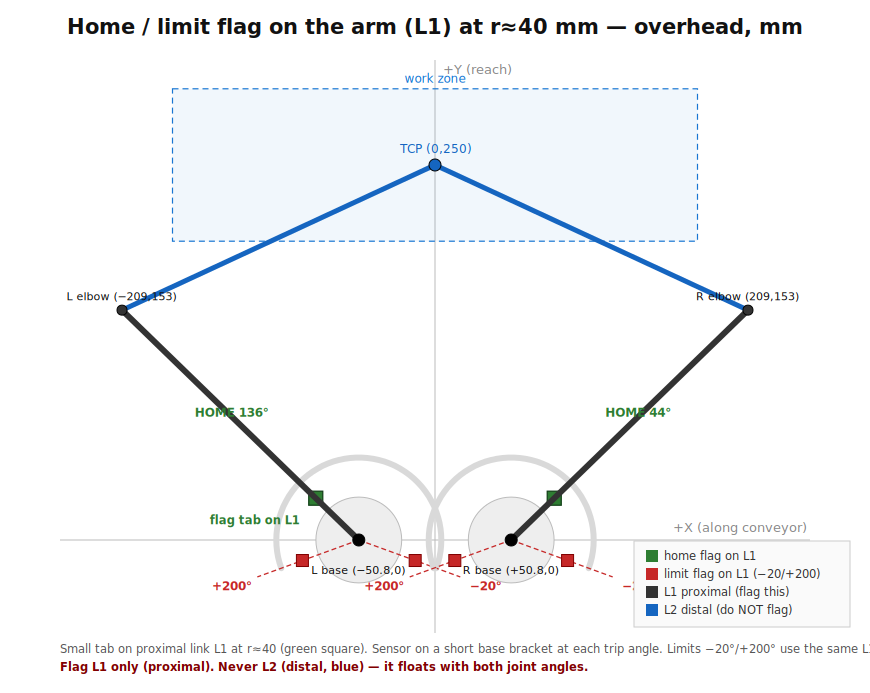

# Homing & limit switches

Reference for the 5-bar's home and travel-limit switches. The verified values
live in `config/robot_config.yaml` under the `homing:` block and load via
`bung_cover_robot.robot.HomingConfig`; the PLC homing routine and the GUI's
**Home (find ref)** read them instead of hard-coding.



## Why homing is required

The Leadshine 57HS22-07 steppers are **open-loop** — on every power-up the
controller has no absolute position, so each shoulder must be homed to a switch
before jogging or running. Because of the **3:1 belt reduction**, the home flag
must sense the **shoulder** rotation, not the motor shaft (a motor-side flag is
3× ambiguous).

## Flag on the proximal link (L1), never the distal (L2)

The 60T output pulley and the **proximal link L1** are one rigid body about the
shoulder pivot, so a small flag **tab on L1** carries the exact 1:1 joint angle —
and is easier to fabricate than a pulley feature.

- **Flag L1 (proximal).** In a 5-bar the **distal link L2 floats** (its
  orientation depends on *both* shoulder angles), so an L2 flag has no single
  home angle — never flag L2.
- **Flag radius `flag_radius_mm = 40`.** Close to the hub → short, stiff sensor
  bracket. A larger radius improves angular repeatability (prox ~0.1 mm ≈ 0.14°
  at r=40 vs ~0.057° at r=100) at the cost of a longer bracket; 40 mm is the
  chosen balance. For tighter homing without moving the flag, use an optical slot
  sensor and/or a two-stage (fast-approach → back-off → slow-reapproach) home.

## Trip angles & coordinates (robot frame, mm)

Both shoulders share the same trip angles (CCW from +X). Marker = flag/sensor
position at `base + r·(cos θ, sin θ)` with `r = 40 mm`.

| Switch | Trip angle | Left L1 flag | Right L1 flag |
|---|---|---|---|
| Min hard limit | −20° | (−2.4, −13.7) | (+77.6, −13.7) |
| **Home reference** | L 140.54° / R 39.46° | (−70.9, +25.4) | (+70.9, +25.4) |
| Max hard limit | +200° | (−77.6, −13.7) | (+2.4, −13.7) |

Pivots: left base (−40, 0), right base (+40, 0). Home reference pose is the
centred, well-conditioned TCP **(0, 250)** (arms splayed left-up/right-down,
clear of the parallel-singularity band).

## Home is mid-travel — read it only during homing

Across the work zone the **left shoulder sweeps ~93°→188°** and the **right
~−8°→87°**, so the home angle (140.54° / 39.46°) sits mid-travel and the flag
**passes the sensor during normal motion**. That is fine: the PLC reads the home
switch **only during the homing routine** and ignores it otherwise. (If you later
want the home switch to double as a live position check, move the home pose
outside the working band instead.)

## Homing sequence (PLC-owned, Claude.md §7)

1. Enable drives.
2. Drive each shoulder toward its home switch from one consistent direction.
3. On trigger, back off and re-approach slowly for repeatability.
4. Set the reference to the home angle (L 140.54° / R 39.46°); report it in
   `VisionRobot.Status.ActualLeft/RightDeg`, set `VisionRobot.Status.Homed`.
5. Soft limits (−20°…+200°) become active.

Python side: `RobotTestController.home_reference()` → `RobotDriver.home()` →
(for a real robot) `PlcRobotDriver` pulses `VisionRobot.Manual.HomeRequest` and
waits for `Homed` (Claude.md §11).

## Switch selection & wiring

- **Home sensor:** inductive proximity (repeatable, non-contact) or optical slot
  sensor; one per shoulder, body on a short base bracket, target tab on L1.
- **Hard limits:** min (−20°) and max (+200°) per shoulder, wired into the drive
  **ENABLE / fault chain** (and/or ClearLink limit inputs) so they act even if
  the PLC logic hangs. `limit_min_deg` / `limit_max_deg` mirror `joint_limits` in
  the config; the software jog guard uses `joint_limits`, these document the
  physical switch angles for the PLC.

## Config block

```yaml
homing:
  home_left_deg: 140.5406
  home_right_deg: 39.4594
  home_tcp_mm: [0.0, 250.0]
  flag_radius_mm: 40.0
  limit_min_deg: -20.0
  limit_max_deg: 200.0
```

The figure above is regenerated to scale from the verified geometry; the SVG
(`docs/homing_placement.svg`) is editable for markup.
