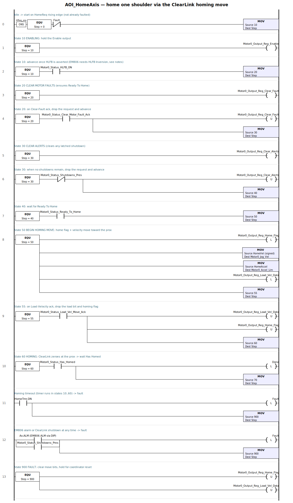
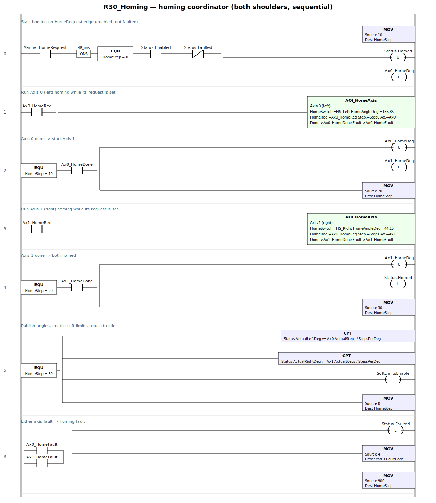

# Homing routine — Studio 5000 build sheet

Complete, near-drop-in implementation of the homing sequence outlined in
`docs/plc_program.md` §8. Two parts:

- **`AOI_HomeAxis`** — an Add-On Instruction that homes **one** shoulder by
  commanding the **ClearLink's built-in homing move** and waiting for `Has
  Homed`.
- **`R30_Homing`** — the coordinator that homes both shoulders **sequentially**
  and publishes `VisionRobot.Status.Homed`.

> **Corrected against the Teknic *ClearLink EtherNet/IP Object Data Reference*,
> Rev. 1.15.** Earlier drafts hand-rolled a fast/back-off/slow jog state machine
> in ladder — that is **wrong for the ClearLink**, which performs the homing move
> itself (Step & Direction Motor Output/Status objects, class `0x66`/`0x65`). The
> PLC configures the home sensor + homing-enable, commands **one** homing move,
> and polls `Has Homed`. See `docs/plc_program.md` §3 for the assembly map.

Mechanical placement of the switches is in `docs/homing.md`; the reference
values come from the `homing:` block in `config/robot_config.yaml`.

---

## 1. Tags & constants to create

**Controller tags**

| Tag | Type | Notes |
|---|---|---|
| `Ax0`, `Ax1` | `AxisIF` (alias, below) | left / right shoulder Step-Dir assembly block |
| `Ax0_HomeReq`, `Ax1_HomeReq` | BOOL | per-axis "run homing" request |
| `Ax0_HomeDone`, `Ax1_HomeDone` | BOOL | per-axis homed |
| `Ax0_HomeFault`, `Ax1_HomeFault` | BOOL | per-axis fault |
| `HomeAxis0`, `HomeAxis1` | `AOI_HomeAxis` | AOI backing tags (one per axis) |
| `HomeStep` | DINT | coordinator state |
| `HR_prev` | BOOL | HomeRequest edge-detect storage |
| `SoftLimitsEnable` | BOOL | mirror of per-axis `Config Register.SoftLimitEnable` |

> The **home prox switches wire to ClearLink inputs**, not PLC tags — each motor's
> `Home Sensor` connector (Configuration assembly) points at its prox, and the
> ClearLink reads it during the homing move. You may still read those inputs via
> the Discrete Input Point object for HMI/diagnostics, but the homing logic does
> not need `HS_Left`/`HS_Right` PLC tags.

**Tuning constants** (starting values — verify on the bench)

| Constant | Type | Suggested | Meaning |
|---|---|---|---|
| `STEPS_PER_DEG` | REAL | `26.66667` | 3200 × 3 / 360 |
| `HOME_VEL` | DINT | `800` | homing-move speed toward the switch, steps/s (~30°/s) |
| `HOME_ACC` | DINT | `20000` | homing accel, steps/s² |
| `HOME_TIMEOUT` | DINT | `10000` | homing-move timeout, ms |
| `HOME_OFFSET_L` | DINT | `ROUND(135.8504*26.66667)` | switch angle → steps, left |
| `HOME_OFFSET_R` | DINT | `ROUND(44.1496*26.66667)` | switch angle → steps, right |

> **`HOME_VEL` sets repeatability.** The ClearLink zeroes position when the home
> sensor trips during a homing move; a slower approach = a more repeatable datum.
> A single slow approach is enough — you do **not** need the old back-off /
> re-approach dance (that was a hand-rolled workaround the ClearLink doesn't need).

**Axis interface `AxisIF`** — an alias over the ClearLink Step-Dir tags for one
motor (`ClearLink:O1`/`:I1`, `docs/plc_program.md` §3). These are the **exact AOP
tag names** from Teknic's `SD_Homing`/`SD_Position_Move` examples (Motor 0 shown;
Motor 1 is `Motor1_*`):

| `AxisIF` member | Real AOP tag |
|---|---|
| `JogVel` | `ClearLink:O1.Motor0_Jog_Vel` |
| `AccelLim` | `ClearLink:O1.Motor0_Accel_Lim` |
| `Enable` | `ClearLink:O1.Motor0_Output_Reg_Enable` |
| `HomeFlag` | `ClearLink:O1.Motor0_Output_Reg_Home_Flag` |
| `LoadVelData` | `ClearLink:O1.Motor0_Output_Reg_Load_Vel_Data` |
| `ClearFault` | `ClearLink:O1.Motor0_Output_Reg_Clear_Fault` |
| `ClearAlerts` | `ClearLink:O1.Motor0_Output_Reg_Clear_Alerts` |
| `CmdPosition` | `ClearLink:I1.Motor0_CommandedPosn` (open-loop position) |
| `HLFB_ON` | `ClearLink:I1.Motor0_Status_HLFB_ON` |
| `StepsActive` | `ClearLink:I1.Motor0_Status_Steps_Active` (axis moving, bit 1) |
| `InHomeSensor` | `ClearLink:I1.Motor0_Status_In_Home_Sensor` (prox state, bit 7 — diagnostic) |
| `ReadyToHome` | `ClearLink:I1.Motor0_Status_Ready_To_Home` |
| `LoadVelMoveAck` | `ClearLink:I1.Motor0_Status_Load_Vel_Move_Ack` |
| `HasHomed` | `ClearLink:I1.Motor0_Status_Has_Homed` |
| `ClearFaultAck` | `ClearLink:I1.Motor0_Status_Clear_Motor_Fault_Ack` |
| `ShutdownsPres` | `ClearLink:I1.Motor0_Status_Shutdowns_Pres` |
| `ALM` | EM806 alarm → a ClearLink digital input (read via the DIP object) |

> Open-loop reminder (`docs/plc_program.md` §3): `CmdPosition` is the ClearLink's
> *commanded* step count, not encoder feedback. The ClearLink homing move
> establishes the datum (position 0 **at the switch**); step integrity is assumed
> thereafter. The home *angle* is applied by `HOME_OFFSET_*` when publishing
> `ActualDeg`, since position 0 = the prox trip point, not 135.85°/44.15°.

---

## 2. `AOI_HomeAxis` — per-shoulder homing (commands the ClearLink homing move)

**Prerequisite — one-time Configuration assembly (`<module>:C`, per motor):**
set `Home Sensor` connector = the ClearLink input the shoulder prox is wired to,
`Config Register.HomingEnable` (bit 0) = 1, `Config Register.HomeSensorActiveLevel`
(bit 1) to match the prox, and `Config Register.HLFBInversion` (bit 3) = **0 (OFF)**
for the no-HLFB EM806 — setting it to 1 latches a Motor-Faulted shutdown that
cancels all motion (`docs/plc_program.md` §3). These are sent once when the
EtherNet/IP connection is established.

**Parameters:** `In` HomeReq, HomeVel, HomeAccel, TimeoutPreset · `InOut` Ax
(`AxisIF`) · `Out` Done, Fault · `Local` Step (DINT), HomeTmr (TIMER),
prevReq (BOOL), Moved (BOOL — real motion seen this attempt).

### Ladder



### Structured Text (drop-in) — mirrors Teknic `SD_Homing`

```pascal
(* AOI_HomeAxis — command the ClearLink's built-in homing move for one shoulder.
   State names/sequence follow Teknic's SD_Homing example; the ClearLink itself
   does the approach, sensor detection, and zeroing. *)

HomeTmr.PRE := TimeoutPreset;
HomeTmr.TimerEnable := (Step >= 10) AND (Step < 60);
TONR(HomeTmr);

(* Proof of real motion this attempt: latch while the homing move runs. A stale
   or power-up Has_Homed (bit 13 latches once a reference exists and persists
   across a PLC-only restart) must NOT complete a home with no motion. *)
IF (Step >= 50) AND (Step < 70) AND Ax.StepsActive THEN Moved := 1; END_IF;

CASE Step OF
    0:  (* idle *)
        Done := 0;  Moved := 0;
        IF HomeReq AND NOT prevReq AND NOT Fault THEN Step := 10; END_IF;

    10: (* ENABLING — wait for HLFB (EM806: needs HLFB Inversion, §3/plc_program) *)
        Ax.Enable := 1;
        IF Ax.HLFB_ON THEN Step := 20; END_IF;

    20: (* CLEAR MOTOR FAULTS — ensure Ready To Home *)
        Ax.ClearFault := 1;
        IF Ax.ClearFaultAck THEN Ax.ClearFault := 0;  Step := 30; END_IF;

    30: (* CLEAR ALERTS — clear any latched shutdown *)
        Ax.ClearAlerts := 1;
        IF NOT Ax.ShutdownsPres THEN Ax.ClearAlerts := 0;  Step := 40; END_IF;

    40: (* CHECK READY TO HOME *)
        IF Ax.ReadyToHome THEN Step := 50;
        ELSIF HomeTmr.DN THEN Fault := 1;  Step := 900; END_IF;

    50: (* BEGIN HOMING MOVE — homing flag + a velocity move toward the prox *)
        Ax.HomeFlag := 1;                    (* Output_Reg_Home_Flag *)
        Ax.JogVel   := HomeVel;              (* signed: toward the prox *)
        Ax.AccelLim := HomeAccel;
        Ax.LoadVelData := 1;                 (* Output_Reg_Load_Vel_Data *)
        Step := 55;

    55: (* WAIT FOR HOMING MOVE ACK -> clear the load + homing flag *)
        IF Ax.LoadVelMoveAck THEN
            Ax.LoadVelData := 0;  Ax.HomeFlag := 0;
            Step := 60;
        END_IF;

    60: (* HOMING — ClearLink drives to the sensor and zeroes position there.
           Require Moved: if the axis never stepped (e.g. HOME_VEL still 0, Homing
           Enable not configured, drive not wired) Has_Homed cannot false-complete
           the home — it times out to FaultCode 4 instead. *)
        IF Ax.HasHomed AND Moved THEN Done := 1;  Step := 70;
        ELSIF HomeTmr.DN THEN Fault := 1;  Step := 900; END_IF;

    70: (* homed / idle — hold *)
        ;

    900:(* fault — clear move bits, wait for coordinator reset *)
        Ax.HomeFlag := 0;  Ax.LoadVelData := 0;
END_CASE;

prevReq := HomeReq;

(* drive alarm or a ClearLink shutdown at any time -> fault *)
IF Ax.ALM OR Ax.ShutdownsPres THEN Fault := 1;  Step := 900; END_IF;
```

`Ax.JogVel` is **signed** — its sign sets the approach direction, so flip the sign
per shoulder without touching the logic. The ClearLink stops the move and sets
`CmdPosition := 0` the instant the home sensor trips; the home *angle* is applied
by `HOME_OFFSET_*` when the coordinator publishes `ActualDeg` (§3).

---

## 3. `R30_Homing` — coordinator (both shoulders, sequential)

Homes Axis 0 (left), then Axis 1 (right), then sets `Status.Homed`. Sequential,
not simultaneous: only one proximal link sweeps at a time, so the two arms can't
drive into each other. Verify approach directions give a collision-free sweep
from any startup pose (§5).

### Ladder



### Structured Text (equivalent)

```pascal
(* R30_Homing — sequential homing coordinator *)

(* rising-edge detect on the vision-PC HomeRequest *)
HR_edge := VisionRobot.Manual.HomeRequest AND NOT HR_prev;
HR_prev := VisionRobot.Manual.HomeRequest;

CASE HomeStep OF
    0:  IF HR_edge AND VisionRobot.Status.Enabled
             AND NOT VisionRobot.Status.Faulted THEN
            VisionRobot.Status.Homed := 0;
            Ax0_HomeReq := 1;                 (* start left *)
            HomeStep := 10;
        END_IF;

    10: IF Ax0_HomeDone THEN                  (* left done -> start right *)
            Ax0_HomeReq := 0;
            Ax1_HomeReq := 1;
            HomeStep := 20;
        END_IF;

    20: IF Ax1_HomeDone THEN                  (* right done *)
            Ax1_HomeReq := 0;
            HomeStep := 30;
        END_IF;

    30: (* both homed — publish with the home offset, enable soft limits, idle *)
        VisionRobot.Status.ActualLeftDeg  := (Ax0.CmdPosition + HOME_OFFSET_L) / STEPS_PER_DEG;
        VisionRobot.Status.ActualRightDeg := (Ax1.CmdPosition + HOME_OFFSET_R) / STEPS_PER_DEG;
        VisionRobot.Status.Homed := 1;
        SoftLimitsEnable := 1;              (* Config Register.SoftLimitEnable per axis *)
        HomeStep := 0;

    900:(* homing fault — hold until Status.Faulted is cleared elsewhere *)
        ;
END_CASE;

(* run the axis AOIs every scan; they self-idle at Step 0/50.
   HomeVel is signed: +toward the prox on Ax0, sign per shoulder on Ax1. *)
AOI_HomeAxis(HomeAxis0, HomeReq:=Ax0_HomeReq, HomeVel:=HOME_VEL,
             HomeAccel:=HOME_ACC, TimeoutPreset:=HOME_TIMEOUT, Ax:=Ax0);
Ax0_HomeDone  := HomeAxis0.Done;
Ax0_HomeFault := HomeAxis0.Fault;

AOI_HomeAxis(HomeAxis1, HomeReq:=Ax1_HomeReq, HomeVel:=-HOME_VEL,
             HomeAccel:=HOME_ACC, TimeoutPreset:=HOME_TIMEOUT, Ax:=Ax1);
Ax1_HomeDone  := HomeAxis1.Done;
Ax1_HomeFault := HomeAxis1.Fault;

(* fault rollup -> FaultCode 4 (homing) *)
IF Ax0_HomeFault OR Ax1_HomeFault THEN
    VisionRobot.Status.Faulted   := 1;
    VisionRobot.Status.FaultCode := 4;
    HomeStep := 900;
END_IF;
```

> In the ladder, the AOI calls are gated by `Ax0_HomeReq` / `Ax1_HomeReq` — a
> harmless optimization, since the AOI idles at Step 0/50 anyway. Calling every
> scan (as the ST does) is equivalent and simpler.

Call `R30_Homing` from `R00_Main` every scan. `Manual.HomeRequest` (from the
GUI's **Home (find ref)**) triggers it; the automatic sequence (§7) should also
require `Status.Homed` before its first run.

---

## 4. How this satisfies the Python handshake

`PlcRobotDriver.home()` pulses `VisionRobot.Manual.HomeRequest` and waits for
`VisionRobot.Status.Homed`. This routine: edge-detects that pulse (rung 0),
runs both axes, and sets `Status.Homed` + `ActualLeft/RightDeg` on success
(rung 5) — exactly what the driver polls for. On failure it sets `Status.Faulted`
+ `FaultCode = 4`, which the driver surfaces as a `RobotDriverError`.

---

## 5. Commissioning the homing routine

1. In MSP/config, confirm each motor's `Home Sensor` connector points at the
   right prox input and `Homing Enable` (Config Register bit 0) is set. Read the
   prox via the DIP object and confirm it toggles when you pass the L1 flag.
2. Jog each axis manually and confirm the **sign of `HOME_VEL`** drives it
   **toward** its home prox. Flip the sign per shoulder if reversed.
3. Verify the homing sweep from any startup pose does **not** collide the two
   arms (sequential homing means the idle arm is held). Adjust approach direction
   or pre-park if a sweep is unsafe.
4. Tune `HOME_VEL`: slower approach = more repeatable datum. Re-home a few times
   and confirm the switch trip (`Has Homed`) repeats to your tolerance.
5. Set `HOME_OFFSET_L`/`HOME_OFFSET_R` so that after homing
   `Status.ActualLeftDeg ≈ 135.85`, `Status.ActualRightDeg ≈ 44.15` (position 0
   is the prox trip point, not the home angle — the offset bridges the two).
6. Block a prox so the switch never trips to confirm `HOME_TIMEOUT` →
   `FaultCode 4`.
7. Confirm the soft limits (−20/+200, `Config Register.SoftLimitEnable` + `Soft
   Limit 1/2`) go active only after `Status.Homed`.
```

---

## 6. Troubleshooting — "motor never moves, but I get HomeDone / Has Homed"

Two facts explain this pair of symptoms:

- **`Has_Homed` (bit 13) is a latched level, not an event.** Once the ClearLink
  has a reference it stays 1 and survives a PLC-only restart. It can also read 1
  at power-up before you ever run a homing move. Trusting it as a level means the
  state machine can walk `0 → 60`, see a stale `1`, and latch `Ax_HomeDone` with
  **no motion and no prox trip** — exactly what you saw.
- **The motor not moving is a commissioning gap, not the ladder.** The handshake
  (`Home_Flag` + a `Load_Vel_Data` velocity move → `Load_Vel_Move_Ack`) matches
  Teknic's `SD_Homing`. If it acks but nothing turns, the usual causes are:
  `HOME_VEL_0/1` still `0` (never set after the CSV import — it imports as 0),
  `Config Register.Homing Enable` (bit 0) not set in `:C`, the EM806 step/dir/enable
  not wired, or `Enable Inversion` (bit 2) wrong.

**What changed in the ladder:** State 60 now requires `Home{m}_Moved` alongside
`Has_Homed`. `Home{m}_Moved` latches from `Status_Steps_Active` (bit 1) only while
the homing move is running, and is cleared at the start of every attempt. So a
stale `Has_Homed` with no motion can no longer complete a home — it times out to
`FaultCode 4`, which points you straight at the commissioning gap above instead of
silently reporting a false datum. Watch `Status_In_Home_Sensor` (bit 7) live to
confirm the prox actually toggles as the flag passes it.
