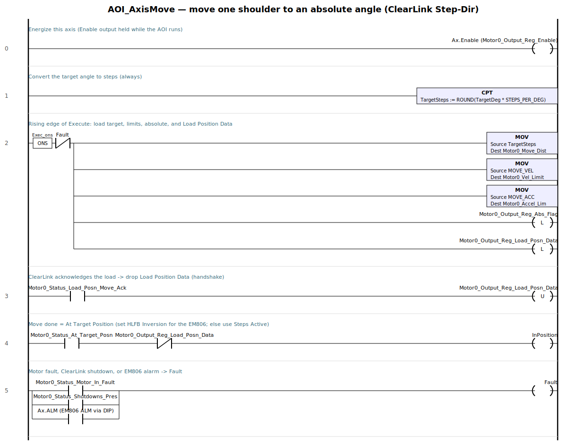
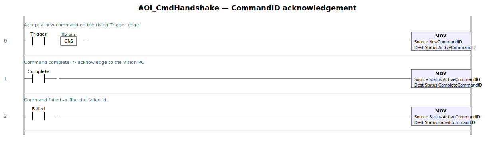
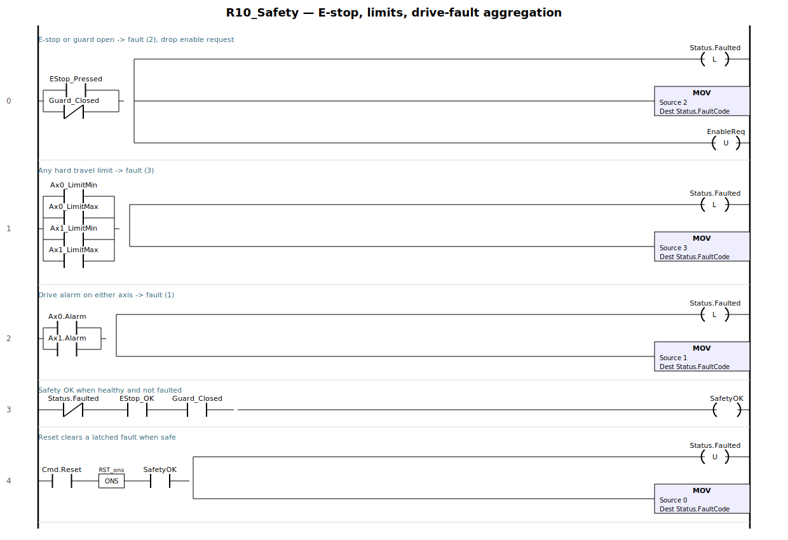
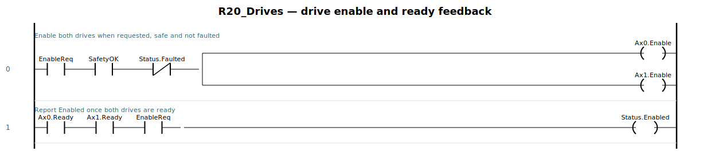
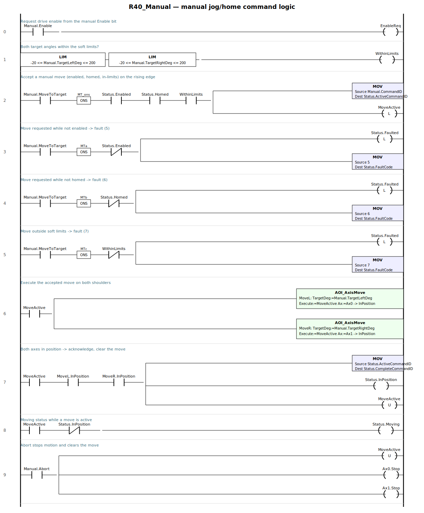
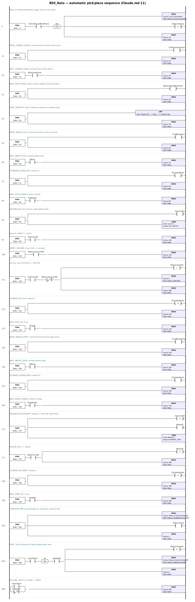
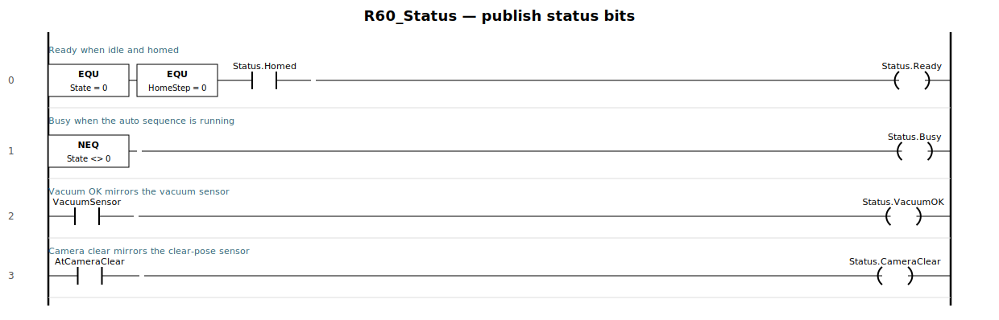

# Ladder + Structured Text build sheets — all routines

Drop-in build for every PLC routine except homing (which has its own sheet,
[`docs/plc_homing.md`](plc_homing.md)). This complements
[`docs/plc_program.md`](plc_program.md) (architecture, UDT, tag contract) by
giving the actual logic in two equivalent forms:

- **Ladder** — a rung diagram to rebuild in Studio 5000.
- **Structured Text** — paste directly into an ST routine/AOI.

They are the same logic; use whichever your routine type is. ST is literally
pasteable; the ladder is the visual to rebuild rung-by-rung.

**Scan order** — call from `R00_Main` each scan: `R10_Safety` → `R20_Drives` →
`R30_Homing` → (`R40_Manual` **or** `R50_Auto`, by mode) → `R60_Status`.

---

## Shared: `AxisIF` UDT & constants

One `AxisIF` per shoulder (`Ax0`, `Ax1`), aliasing the ClearLink **Step-Dir**
`ClearLink:O1`/`:I1` motor block. Members alias the **exact AOP tags** (full list
+ homing members in `docs/plc_homing.md` §1); the move-related superset:

| Member | Real AOP tag (Motor 0) |
|---|---|
| `MoveDist` | `ClearLink:O1.Motor0_Move_Dist` |
| `VelLimit` | `ClearLink:O1.Motor0_Vel_Limit` |
| `AccelLim` | `ClearLink:O1.Motor0_Accel_Lim` |
| `Enable` | `ClearLink:O1.Motor0_Output_Reg_Enable` |
| `AbsFlag` | `ClearLink:O1.Motor0_Output_Reg_Abs_Flag` |
| `LoadPosnData` | `ClearLink:O1.Motor0_Output_Reg_Load_Posn_Data` |
| `CmdPosition` | `ClearLink:I1.Motor0_CommandedPosn` |
| `AtTargetPosn` | `ClearLink:I1.Motor0_Status_At_Target_Posn` |
| `StepsActive` | `ClearLink:I1.Motor0_Status_Steps_Active` |
| `LoadPosnMoveAck` | `ClearLink:I1.Motor0_Status_Load_Posn_Move_Ack` |
| `MotorInFault` | `ClearLink:I1.Motor0_Status_Motor_In_Fault` |
| `ShutdownsPres` | `ClearLink:I1.Motor0_Status_Shutdowns_Pres` |
| `ALM` | EM806 alarm → a ClearLink digital input (DIP object) |

> **No Teknic motion AOI, but working example projects** — Teknic ships
> CompactLogix examples (`SD_Position_Move`, `SD_Homing`, `SD_Jog`, …); build from
> those. The **exact AOP tag names** are in `docs/plc_homing.md` §1
> (`ClearLink:O1.Motor0_Output_Reg_Enable`, `..._Load_Posn_Data`,
> `ClearLink:I1.Motor0_Status_At_Target_Posn`, …). There is no
> `MoveTrigger`/`MoveDone`/`Redefine` member — those were invented; use the
> Load-Posn-Data → Ack handshake, and for homing the ClearLink's built-in homing
> move (`plc_homing.md`).

Constants: `STEPS_PER_DEG := 26.66667`, `MOVE_VEL/MOVE_ACC/MOVE_DEC` (move
profile), plus `VAC_SETTLE`, `BLOWOFF_TIME` (timer presets, ms) and the pose
angles `PickL/PickR/DropL/DropR`, `CAMERA_CLEAR_L/CAMERA_CLEAR_R`. Fault codes are
the table in `plc_program.md` §9.

---

## `AOI_AxisMove` — move one shoulder to an absolute angle

Params: `In` TargetDeg (REAL), Execute (BOOL), StepsPerDeg (REAL) · `InOut` Ax
(`AxisIF`) · `Out` InPosition (BOOL), Fault (BOOL) · `Local` prevExec, Loaded
(BOOL).



Mirrors Teknic's `SD_Position_Move`: load the move, latch **Load_Posn_Data**,
clear it on the **Ack**, and take *move done* from **At_Target_Posn**
(`Steps_Active == 0` if the EM806's HLFB Inversion isn't set — §3).

```pascal
Ax.Enable := 1;                                 (* Motor_Output_Reg_Enable *)

IF Execute AND NOT prevExec AND NOT Fault THEN  (* rising edge: load the move *)
    Ax.MoveDist  := TRUNC(TargetDeg * StepsPerDeg);
    Ax.VelLimit  := MOVE_VEL;
    Ax.AccelLim  := MOVE_ACC;
    Ax.AbsFlag   := 1;                           (* absolute move *)
    Ax.LoadPosnData := 1;                        (* Output_Reg_Load_Posn_Data *)
    Loaded := 1;
END_IF;
prevExec := Execute;

IF Ax.LoadPosnMoveAck THEN Ax.LoadPosnData := 0; END_IF;   (* handshake ack *)

InPosition := Loaded AND Ax.AtTargetPosn AND NOT Ax.LoadPosnData;
IF InPosition THEN Loaded := 0; END_IF;
Fault := Ax.MotorInFault OR Ax.ShutdownsPres OR Ax.ALM;
```

---

## `AOI_CmdHandshake` — CommandID acknowledgement

Params: `In` NewCommandID (DINT), Trigger, Complete, Failed (BOOL) · `InOut`
Status (`VisionRobot_Status`) · `Local` Trig_prev (BOOL).



```pascal
IF Trigger AND NOT Trig_prev THEN
    Status.ActiveCommandID := NewCommandID;
END_IF;
Trig_prev := Trigger;
IF Complete THEN Status.CompleteCommandID := Status.ActiveCommandID; END_IF;
IF Failed   THEN Status.FailedCommandID   := Status.ActiveCommandID; END_IF;
```

---

## `R10_Safety` — E-stop, limits, drive-fault aggregation



```pascal
IF EStop_Pressed OR NOT Guard_Closed THEN
    VisionRobot.Status.Faulted := 1; VisionRobot.Status.FaultCode := 2;
    EnableReq := 0;
END_IF;
IF Ax0_LimitMin OR Ax0_LimitMax OR Ax1_LimitMin OR Ax1_LimitMax THEN
    VisionRobot.Status.Faulted := 1; VisionRobot.Status.FaultCode := 3;
END_IF;
IF Ax0.Alarm OR Ax1.Alarm THEN
    VisionRobot.Status.Faulted := 1; VisionRobot.Status.FaultCode := 1;
END_IF;
SafetyOK := (NOT VisionRobot.Status.Faulted) AND EStop_OK AND Guard_Closed;
IF VisionRobot.Cmd.Reset AND NOT Reset_prev AND SafetyOK THEN
    VisionRobot.Status.Faulted := 0; VisionRobot.Status.FaultCode := 0;
END_IF;
Reset_prev := VisionRobot.Cmd.Reset;
```

---

## `R20_Drives` — drive enable & ready feedback



```pascal
Ax0.Enable := EnableReq AND SafetyOK AND NOT VisionRobot.Status.Faulted;
Ax1.Enable := Ax0.Enable;
VisionRobot.Status.Enabled := Ax0.Ready AND Ax1.Ready AND EnableReq;
```

---

## `R40_Manual` — manual jog/home command logic

Handles the `VisionRobot.Manual.*` surface (enable, absolute move, abort).
Homing is delegated to `R30_Homing`; physical drive enable is done by `R20_Drives`.



```pascal
EnableReq := VisionRobot.Manual.Enable;

WithinLimits :=
    (VisionRobot.Manual.TargetLeftDeg  >= -20.0) AND
    (VisionRobot.Manual.TargetLeftDeg  <= 200.0) AND
    (VisionRobot.Manual.TargetRightDeg >= -20.0) AND
    (VisionRobot.Manual.TargetRightDeg <= 200.0);

(* accept / reject a move on the rising edge (ladder splits the reject into
   three rungs; ST folds them into one ELSIF chain) *)
IF VisionRobot.Manual.MoveToTarget AND NOT MTT_prev THEN
    IF VisionRobot.Status.Enabled AND VisionRobot.Status.Homed AND WithinLimits THEN
        VisionRobot.Status.ActiveCommandID := VisionRobot.Manual.CommandID;
        MoveActive := 1;
    ELSIF NOT VisionRobot.Status.Enabled THEN
        VisionRobot.Status.Faulted := 1; VisionRobot.Status.FaultCode := 5;
    ELSIF NOT VisionRobot.Status.Homed THEN
        VisionRobot.Status.Faulted := 1; VisionRobot.Status.FaultCode := 6;
    ELSE
        VisionRobot.Status.Faulted := 1; VisionRobot.Status.FaultCode := 7;
    END_IF;
END_IF;
MTT_prev := VisionRobot.Manual.MoveToTarget;

AOI_AxisMove(MoveL, TargetDeg:=VisionRobot.Manual.TargetLeftDeg,
             Execute:=MoveActive, StepsPerDeg:=STEPS_PER_DEG, Ax:=Ax0);
AOI_AxisMove(MoveR, TargetDeg:=VisionRobot.Manual.TargetRightDeg,
             Execute:=MoveActive, StepsPerDeg:=STEPS_PER_DEG, Ax:=Ax1);

IF MoveActive AND MoveL.InPosition AND MoveR.InPosition THEN
    VisionRobot.Status.CompleteCommandID := VisionRobot.Status.ActiveCommandID;
    VisionRobot.Status.InPosition := 1;
    MoveActive := 0;
END_IF;
VisionRobot.Status.Moving := MoveActive AND NOT VisionRobot.Status.InPosition;

IF VisionRobot.Manual.Abort THEN
    MoveActive := 0; Ax0.Stop := 1; Ax1.Stop := 1;
END_IF;
```

---

## `R50_Auto` — automatic pick/place sequence

The Claude.md §11 state machine. Advances on real status bits; timers only for
vacuum settle and blowoff.



```pascal
(* service the two process timers each scan *)
VacTmr.PRE := VAC_SETTLE;  VacTmr.TimerEnable := (State = 90) OR (State = 100);
TONR(VacTmr);
BlowTmr.PRE := BLOWOFF_TIME;  BlowTmr.TimerEnable := (State = 170);
TONR(BlowTmr);

CASE State OF
    0:   VisionRobot.Status.Ready := 1;
         IF VisionRobot.Cmd.RequestPickPlace AND NOT RPP_prev THEN
             VisionRobot.Status.ActiveCommandID := VisionRobot.Cmd.CommandID;
             VisionRobot.Status.Ready := 0;  State := 10;
         END_IF;
    10:  CmdCameraClear := 1;  State := 20;              (* MOVE_CAMERA_CLEAR *)
    20:  IF AtCameraClear THEN VisionRobot.Status.CameraClear := 1; State := 30; END_IF;
    30:  VisionRobot.Status.ReadyForVision := 1;  State := 40;
    40:  (* latch Target.Pick_* / Drop_* into PickL/PickR/DropL/DropR *) State := 50;
    50:  CmdMovePick := 1;  State := 60;                 (* MOVE_ABOVE_PICK *)
    60:  IF AtPick THEN State := 70; END_IF;
    70:  CylinderDown := 1;  State := 80;                (* CYLINDER_DOWN_PICK *)
    80:  IF PickDown THEN State := 90; END_IF;
    90:  VacuumOn := 1;                                  (* VACUUM_ON *)
         IF VacTmr.DN THEN State := 100; END_IF;
    100: IF VisionRobot.Status.VacuumOK THEN State := 110;   (* VERIFY_VACUUM *)
         ELSIF VacTmr.DN THEN
             VisionRobot.Status.Faulted := 1;
             VisionRobot.Status.FaultCode := 9;  State := 900;
         END_IF;
    110: CylinderDown := 0;  State := 120;               (* CYLINDER_UP_PICK *)
    120: IF PickUp THEN State := 130; END_IF;
    130: CmdMoveDrop := 1;  State := 140;                (* MOVE_ABOVE_DROP *)
    140: IF AtDrop THEN State := 150; END_IF;
    150: CylinderDown := 1;  State := 160;               (* CYLINDER_DOWN_DROP *)
    160: IF DropDown THEN State := 170; END_IF;
    170: VacuumOn := 0;  Blowoff := 1;                   (* VACUUM_OFF_BLOWOFF *)
         IF BlowTmr.DN THEN Blowoff := 0;  State := 180; END_IF;
    180: CylinderDown := 0;  State := 190;               (* CYLINDER_UP_DROP *)
    190: IF DropUp THEN State := 200; END_IF;
    200: VisionRobot.Status.CompleteCommandID := VisionRobot.Status.ActiveCommandID;
         VisionRobot.Status.Done := 1;  State := 0;      (* COMPLETE_JOB *)
    900: IF VisionRobot.Cmd.Reset AND NOT AR_prev AND SafetyOK THEN
             VisionRobot.Status.Faulted := 0;
             VisionRobot.Status.FailedCommandID := VisionRobot.Status.ActiveCommandID;
             State := 0;
         END_IF;
END_CASE;
RPP_prev := VisionRobot.Cmd.RequestPickPlace;
AR_prev  := VisionRobot.Cmd.Reset;

(* any state: abort or unsafe -> FAULT *)
IF VisionRobot.Cmd.Abort OR NOT SafetyOK THEN State := 900; END_IF;
```

**Move dispatcher** — the `Cmd*`/`At*` bits above resolve to `AOI_AxisMove`
against the pose constants (keeps the state machine readable):

```pascal
IF CmdCameraClear THEN AutoTL:=CAMERA_CLEAR_L; AutoTR:=CAMERA_CLEAR_R; AutoMove:=1; CmdCameraClear:=0; END_IF;
IF CmdMovePick    THEN AutoTL:=PickL; AutoTR:=PickR; AutoMove:=1; CmdMovePick:=0; END_IF;
IF CmdMoveDrop    THEN AutoTL:=DropL; AutoTR:=DropR; AutoMove:=1; CmdMoveDrop:=0; END_IF;

AOI_AxisMove(AutoL, TargetDeg:=AutoTL, Execute:=AutoMove, StepsPerDeg:=STEPS_PER_DEG, Ax:=Ax0);
AOI_AxisMove(AutoR, TargetDeg:=AutoTR, Execute:=AutoMove, StepsPerDeg:=STEPS_PER_DEG, Ax:=Ax1);

Arrived       := AutoL.InPosition AND AutoR.InPosition;
AtCameraClear := Arrived AND (AutoTL = CAMERA_CLEAR_L);
AtPick        := Arrived AND (AutoTL = PickL);
AtDrop        := Arrived AND (AutoTL = DropL);
```

`CylinderDown`, `VacuumOn`, `Blowoff` are the pneumatic solenoid outputs;
`PickDown/PickUp/DropDown/DropUp` are the Z reed switches.

---

## `R60_Status` — publish status bits

Bits not already set by other routines (Enabled/Homed/InPosition/CommandIDs/
Actual angles are set where they occur).



```pascal
VisionRobot.Status.Ready      := (State = 0) AND (HomeStep = 0)
                                 AND VisionRobot.Status.Homed;
VisionRobot.Status.Busy       := (State <> 0);
VisionRobot.Status.VacuumOK   := VacuumSensor;
VisionRobot.Status.CameraClear := AtCameraClear;
```
